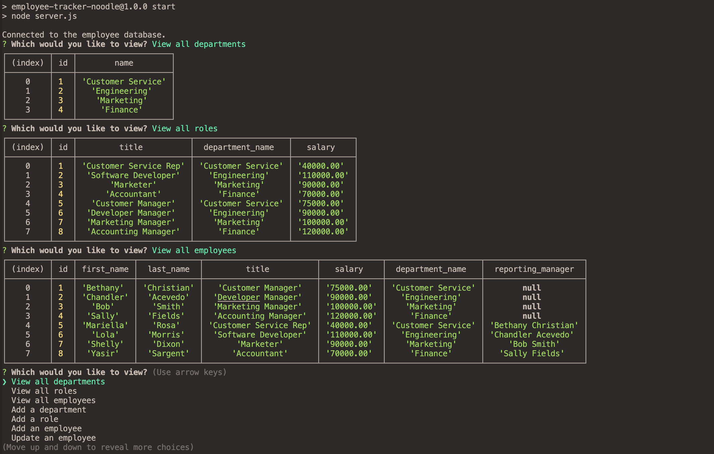

# Employee-Tracker-Noodle

## Table of Contents
- [Description](#description)
- [Media](#media)
- [Scope](#scope-of-project)
- [Tools](#tools-used)
- [Install](#how-to-install)
- [Test](#how-to-test)

## Description
Content management systems (CMS), Used to manage a company's employee database, user will be able to view database of employees and be able to manipulate the data.

## Media
### screenshots

### video 

https://user-images.githubusercontent.com/96491122/168473922-0f049c70-9987-4151-9bcc-053c91785f9a.mp4

## Scope of project
- Scope is of the project is to use node.js and mysql in conjunction to track employees info

## Tools used
- NPM
    - Node.js
    - Mysql2
    - inquirer
    - Console.table
    - dotenv
- Java Script

## How to install 
- run "npm install" in terminal to download the dependencies in order to run application
- Make an .env file on the root level of Employee Tracker folder and enter you mysql user name and password.
- IF no database, within mysql shell run source "db/schema.sql" then "db/seeds.sql" and then exit and start application 

## How to test with in terminal 
- run "npm start" ( to start the server and application )

